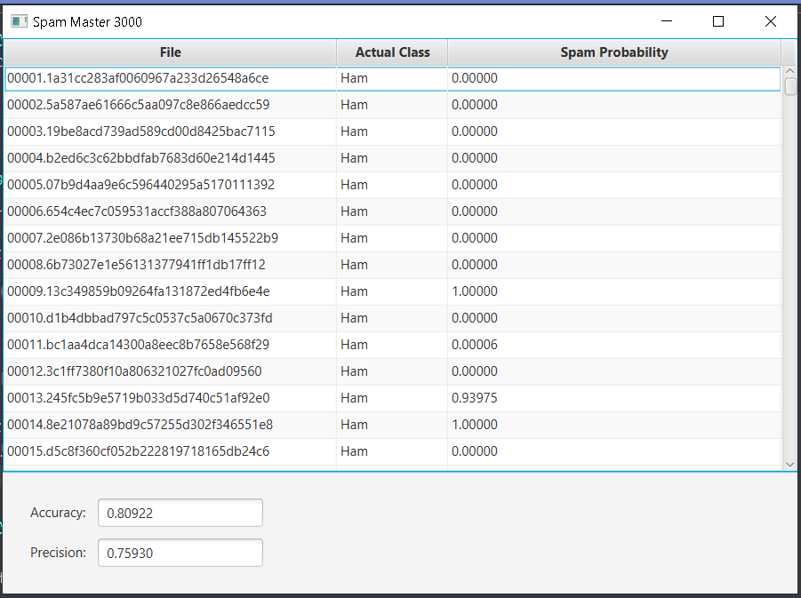

# Spam Detection

### Description:
This application takes in a directory that contain two other directories A and B.
Directory A should contain spam files while directory B should contain
files that are not spam. The program then goes through these files and
outputs percentages on a table to display whether a given file is spam 
or not (1.0 being 100% spam).

### Improvements:
We made the program less case sensitive when determining the unique
words within a file for example "YOLO" and "YolO" would have been
registered as two different words when in reality they are the same.
As a result we managed to improve the accuracy and precision of the
spam detector.

### How to run:
When the repository is cloned head to the evaluation.java class
and run the class. A prompt will appear where you have to select a 
directory that contain two other directories A and B.
Directory A should contain spam files while directory B should contain
files that are not spam. Once that is done you wait and the program
will produce a table.

### References:
